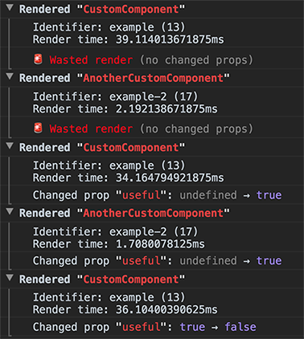

# React Performance 🚀

Helpers to debug and record component render performance

With the release of React Fiber in v16, `react-addons-perf` has officially become obsolete. This project aims to be a "close enough" alternate solution.

#### Logs



#### Reports


#### Timing


<br />

## Installation

- [Yarn](https://yarnpkg.com): `yarn add react-performance`
- [npm](https://www.npmjs.com): `npm install react-performance`

<br />

## Usage

```js
import ReactPerformance from 'react-performance'
```

You can also choose to import selectively:

```js
import { measure, startRecording, printRecording } from 'react-performance'
```

NOTE: In a production environment, `ReactPerformance` disables itself.

### Measure

To measure the rendering of a component, wrap it with the `measure` HOC:

```js
class MyComponent extends React.Component {/* ... */}

export default ReactPerformance.measure({
  getId: 'some_recognizable_identifier',
  Component: MyComponent,
  isCollapsed: false,
})
```

That's it. Now logs will print every time the component renders.

If you use Redux, read the section below on how to [Use with Redux](#use-with-redux).

##### Options:

- `getId` is a string or function that helps you uniquely identify each component being rendered in the logs.
  - As a string, if it is a key of the component's `props`, the key and value are both used. Otherwise it is used as a static value.
  - As a function, it receives `props` and returns a string.
- `isCollapsed` is `true` by default.
  - This collapses the duration & diff logs when a component renders.

### Record

To generate reports, start recording data by running:

```js
ReactPerformance.startRecording()
```

And then print out the report by running:

```js
ReactPerformance.printRecording()
```

This prints out a report on all the components being measured.

### Use with Redux

#### `connect`

Only "smart" components should be measured since those are typically the components that respond to state changes (and usually the only components that significantly impact performance).

With the assumption that any data passed down to components is encapsulated in a top-level state, the most appropriate way to use this with Redux is to use `ReactPerformance.connect`:

```js
class MyComponent extends React.Component {/* ... */}

export default ReactPerformance.connect({
  mapStateToProps,
  mapDispatchToProps,
  getId: 'some_recognizable_identifier',
  Component: MyComponent,
})
```

This is equivalent to `ReactPerformance.measure` - except it also connects the component to the Redux store.

#### `createStore`

To get measurements on the full duration across all component renders triggered by dispatching actions, a middleware is provided to create the store:

```js
const enhancer = redux.compose(
  // ...All other middleware first
  // This must be the last one!
  ReactPerformance.createNotifier(),
)
const store = redux.createStore(rootReducer, enhancer)
```

This will log measurements in batches of rerenders caused by updates to the store:


<br />

---

© 2017 [Amsul](http://twitter.com/amsul_)

Licensed under [MIT](http://amsul.ca/MIT)
